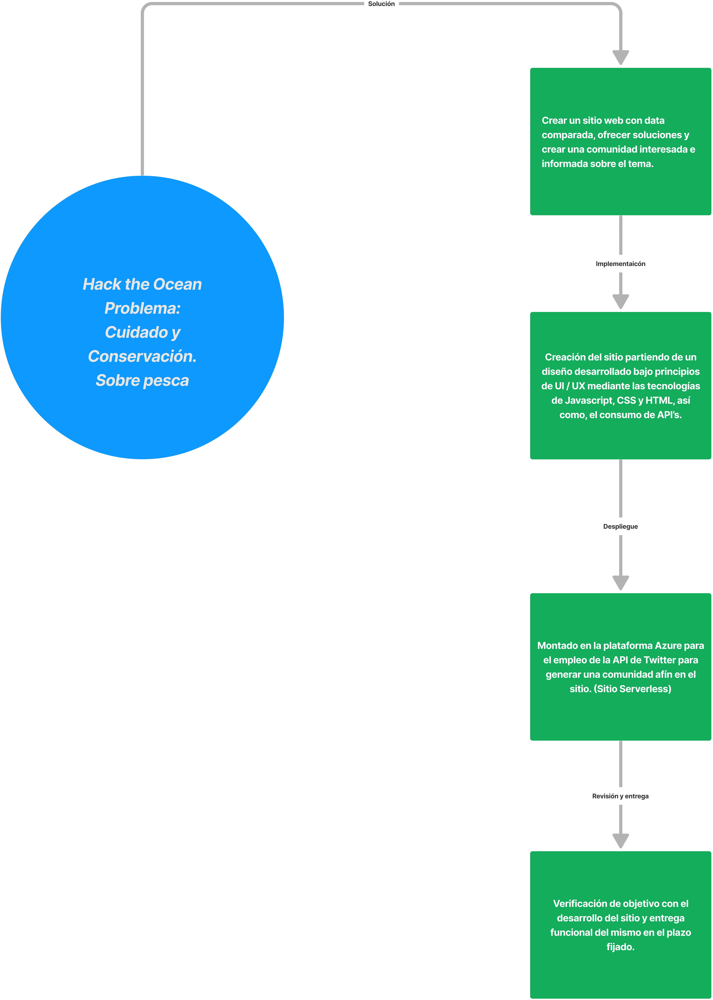
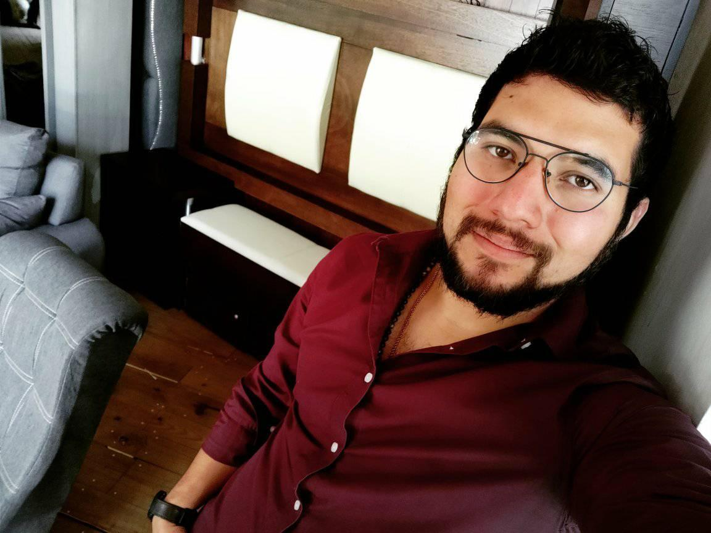
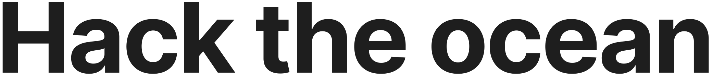
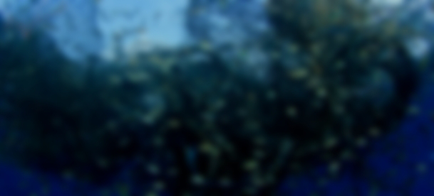
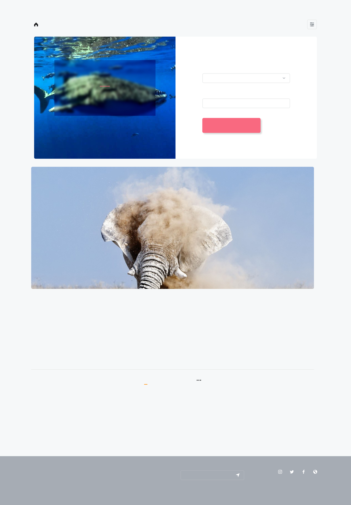
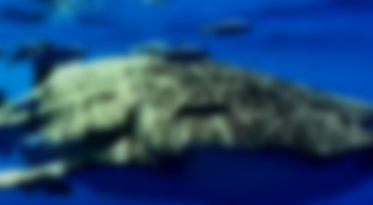

# Hack_The_Ocean
{width="24.75in"
height="34.666666666666664in"}

> Después de hacer una investigación respecto a\
> las problemáticas en los océanos, se determinó\
> que la problemática en la cuál radican todos\
> los demás problemas es la pesca en general y\
> en particular la sobrepesca. Tomamos data de\
> diversos sitios, se comparó y llegamos a la\
> conclusión que el mejor método para lograr un\
> posible cambio es la racionalización y la unión\
> de mentes similares en un mismo sitio. Es por\
> ello que concentramos la información y unimos\
> las relaciones históricas de la data con el\
> sector de la pesca, la regulación de los países\
> como México en donde no buscan\
> sostenibilidad sino desarrollo económico\
> impulsando la industria mediante subsidios y\
> no premiando la innovación que permita la\
> interacción entre la naturaleza y el hombre. Lo\
> hicimos con las tecnologías que sabíamos que\
> manejábamos e intentamos conectarlo de la\
> mejor forma posible. La ejecución es perfectible\
> y es lo que estaremos haciendo los siguientes\
> meses para seguir desarrollando nuestras\
> habilidades y para de verdad lograr un cambio.

{width="78.81944444444444in"
height="39.986111111111114in"}{width="1.0930555555555554in"
height="0.8197922134733159in"}{width="0.7763888888888889in"
height="0.7787073490813649in"}{width="0.7916666666666666in"
height="0.7908420822397201in"}{width="1.4527766841644794in"
height="1.089582239720035in"}{width="1.0319433508311462in"
height="1.0350251531058619in"}{width="1.0527777777777778in"
height="1.051680883639545in"}{width="1.6124989063867017in"
height="1.2093744531933508in"}{width="1.1472222222222221in"
height="1.1506485126859143in"}{width="1.1694433508311461in"
height="1.1682250656167978in"}{width="1.2374989063867017in"
height="1.2362095363079615in"}{width="1.5499989063867017in"
height="1.1624989063867017in"}{width="1.1027777777777779in"
height="1.106071741032371in"}{width="1.1736111111111112in"
height="1.1723884514435696in"}{width="1.6125in"
height="1.2093744531933508in"}{width="1.1458333333333333in"
height="1.149255249343832in"}{width="1.1694433508311461in"
height="1.1682250656167978in"}{width="1.6125in"
height="1.2093744531933508in"}{width="1.1458333333333333in"
height="1.149255249343832in"}{width="1.1694433508311461in"
height="1.1682250656167978in"}

{width="9.63888888888889in"
height="1.0694444444444444in"}

> \#FA7086
>
> \#A6ADB4

+----------+------------------------+
| \#F6F8F9 | > Ag Acumin Pro 13 pts |
+==========+========================+
|          |                        |
+----------+------------------------+

> \#343638
>
> \#FFFFFF

**LOGO** **HOME** **DISCOVERY** **FOTOS** **CONTACT**

SUBSIDIO: UNA PROBLEMÁTICA

> Sobrepesca
>
> La sobrepesca es un problema que está causando la extinción de
> diversas
>
> especies en regiones muy específicas del mundo y aunque el fin no es
> tan
>
> cercano como lo imaginamos, debemos comenzar a tomar medidas para
> evitar
>
> acabar con la fauna marina. Por eso te presentamos los siguientes
> datos para
>
> que miremos el problema de fondo y encontremos una solución a ello.

Fuente: The World Bank Website,
https://datatopics.worldbank.org/sdgatlas/archive/2017/SDG-14-life-below-water.html

> La mayor parte de la pesca en el mundo recibe un\
> incentivo gubernamental que hace más barata la pesca y\
> con ello una actividad más requerida, siendo esto una\
> razón para la sobre pesca.
>
> **Técnicas de pesca**

+----------------------+----------------------+----------------------+
| > **Pesca de         | > **Redes de pesca** | > **Purse Seine**    |
| > Arrastre**         |                      |                      |
+======================+======================+======================+
| Lorem ipsum dolor    | Lorem ipsum dolor    | > Lorem ipsum dolor  |
| sit amet, ipsum      | sit amet, ipsum      | > sit amet, ipsum    |
| labitur              | labitur              | > labitur            |
+----------------------+----------------------+----------------------+
| > lucilius mel id,   | > lucilius mel id,   | > lucilius mel id,   |
| > ad has appareat.   | > ad has appareat.   | > ad has appareat.   |
+----------------------+----------------------+----------------------+

> **¿Se acabará el pescado para el 2048?**

Fuente:Our World in Data,
https://ourworldindata.org/fish-and-overfishing\#methods-of-fishing

> Es muy complejo cambiar nuestros hábitos y paradigmas pero\
> técnicas de pesca de arrastre, de redes, de purse seine u otro no\
> garantizan la pesca de una sola especie y por el contrario acaban\
> con ecosistemas completos. Arrasando con flora y fauna marítima.
>
> Fuente:Our World in Data,
> https://ourworldindata.org/fish-and-overfishing\#methods-of-fishing
>
> Si bien es cierto que la pesca sustenta una parte económica de cada
> país, también es cierto\
> que la pesca está acabando con los océanos de forma exponencial y por
> ello debemos\
> dejarlos respirar. Una posible solución es reducir el consumo o no
> consumirlo, así como,\
> exigir políticas de no subsidio a la industria.
>
> Huella de carbón de la pesca
>
> Fuente: Global Fishing Watch, https://globalfishingwatch.org/
>
> Finalmente, la pesca por sí misma deja una huella impresionante en
> los\
> mares. Aquí podemos observar como impacta cada especie en\
> diferente medida a la huella de carbono.
>
> Las imágenes de la izquierda son imágenes satelitales, en las cuales
> se\
> presume el tráfico de embarcaciones pesqueras específicas. Podemos\
> observar cómo el consumo en 2012 por año mantenía cierto equilibrio\
> entre consumo, tráfico y permitía una cierta pesca sustentable. En
> 2019\
> podemos observar como casi no existen superficies marítimas no\
> explotadas ni exploradas y en 2022 podemos ver una reducción en las\
> operaciones debido al COVID.
>
> La invitación que queremos hacerles con este sitio, es darle un
> respiro\
> a los océanos para regresarles su majestuosidad y también para poder\
> seguir habitando este hermoso planeta como seres vivos. Todos\
> necesitamos de todos. Lo que hagamos hoy será el futuro de otras\
> generaciones. La consciencia que logremos hoy, será la
> sustentabilidad\
> entre humanos, naturaleza y planeta. ¡DALE UN RESPIRO AL MUNDO\
> Y REDUCE O NO CONSUMAS MARISCOS!
>
> Fuente: Global Fishing Watch, https://globalfishingwatch.org/
>
> Fuente: Global Fishing Watch,
> https://globalfishingwatch.org/{width="20.0in"
> height="58.0in"}{width="8.458333333333334in"
> height="3.8333333333333335in"}

LOGO

+----------------+---------------+----------------+----------------+
| > **Home**     | > **About**   | > **           | > Email        |
|                |               | Testimonials** |                |
+================+===============+================+================+
| >              | > **Help**    | >              |                |
|  **Discovery** |               |  **Advertise** |                |
+----------------+---------------+----------------+----------------+
| > **Photos**   | > **Terms**   | > **           | > Stay in      |
|                |               | Integrations** | > touch with   |
|                |               |                | > us for the   |
|                |               |                | > freshest     |
|                |               |                | > products!    |
+----------------+---------------+----------------+----------------+
| > **Contact**  | **Guidlines** | > **Careers**  |                |
+----------------+---------------+----------------+----------------+

+---------+---------+---------+---------+---------+---------+---------+
| *       | **      | > **/   | **I     | >       | > **    | > **CON |
| *LOGO** | Fotos** | >       | NICIO** |  **COMU | FOTOS** | TACTO** |
|         |         |  Testim |         | NIDAD** |         |         |
|         |         | onios** |         |         |         |         |
+---------+---------+---------+---------+---------+---------+---------+

Selecciona la fecha

**Fotos**

**Compártenos fotos que denuncien cualquier**

**tipo de abuso en las prácticas de pesca.**

> Select...
>
> Palabras clave

**SUBE TU ARCHIVO**

> Lorem ipsum dolor sit amet consectetur adipiscing elit sodales primis,
> mollis viverra conubia ligula inceptos laoreet libero
>
> tortor, nascetur non habitasse iaculis tempor nec egestas fames augue,
> platea porta integer nostra curae sed arcu. Nec ut
>
> diam vulputate ante scelerisque ridiculus lobortis orci mi curae
> himenaeos quis, senectus curabitur ullamcorper a porttitor
>
> nibh fermentum nisi cum morbi aliquam. Vitae pretium vestibulum dui
> gravida in potenti interdum, class rhoncus neque
>
> eget magna at
>
> Ullamcorper porttitor non pharetra cursus nisl mollis pellentesque
> primis penatibus platea, dictum himenaeos eget mi
>
> bibendum ad molestie aliquet curae quis quisque, nunc duis ac at
> elementum dui integer viverra tempus. Lacinia
>
> bibendum diam senectus egestas nec molestie convallis aenean hac
> tempus, vivamus purus congue euismod fringilla
>
> cursus donec est eu blandit platea, feugiat vitae netus orci habitant
> accumsan placerat morbi nostra.

<table>
<thead>
<tr class="header">
<th>LOGO</th>
<th><strong>Home</strong></th>
<th><blockquote>

<strong>About</strong>

</blockquote></th>
<th><strong>Testimonials</strong></th>
<th><strong>01</strong></th>
<th>02</th>
<th>03</th>
<th>04</th>
<th>05</th>
<th><blockquote>

06

</blockquote></th>
</tr>
</thead>
<tbody>
<tr class="odd">
<td></td>
<td><strong>Discovery</strong></td>
<td><blockquote>

<strong>Help</strong>

</blockquote></td>
<td><blockquote>

<strong>Advertise</strong>

</blockquote></td>
<td></td>
<td></td>
<td></td>
<td></td>
<td></td>
<td><blockquote>

Email

</blockquote></td>
</tr>
</tbody>
</table>

> In hac habitasse platea dictumst. Sed nec
>
> venenatis odio. Nulla faucibus ipsum sed faucibus
>
> accumsan. Donec rhoncus
> luctus.{width="20.0in"
> height="28.72222222222222in"}{width="5.763888888888889in"
> height="3.1666666666666665in"}

+-------------+---------------+------------------+------------------+
| **Photos**  | **Terms**     | >                | > Stay in touch  |
|             |               | **Integrations** | > with us for    |
|             |               |                  | > the freshest   |
|             |               |                  | > products!      |
+=============+===============+==================+==================+
| **Contact** | **Guidlines** | > **Careers**    |                  |
+-------------+---------------+------------------+------------------+
